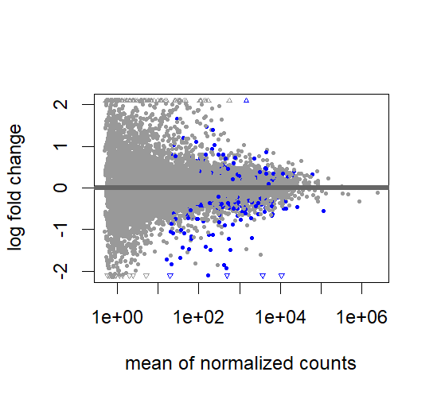

# RNAseq-DESeq2-GSE164073

## Project Overview

This project performs RNA-seq differential expression analysis using DESeq2 on GEO dataset GSE164073.

## Dataset

* GSE164073
* Eye tissue RNA-seq samples
* Count matrix downloaded from GEO
* Sample metadata from SRA Run Table

## Analysis Workflow

1. Import count matrix
2. Create sample metadata
3. Build DESeqDataSet
4. Filter low-count genes
5. Perform DESeq2 differential expression analysis
6. Identify significant DEGs
7. Generate PCA plot
8. Generate MA plot
9. Generate Heatmap
10. Generate Volcano plot

## Tools

* R
* DESeq2
* ggplot2
* pheatmap
* EnhancedVolcano

## Author

Drishti Madaan
## Results

### PCA Plot

### MA Plot

### Heatmap

### Volcano Plot

